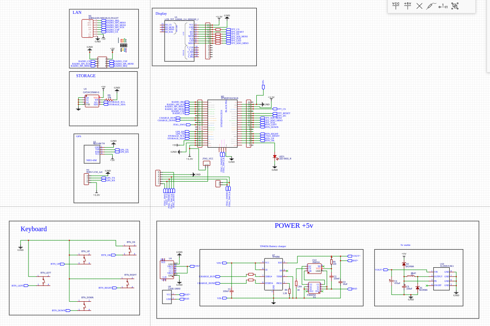

Список дел

1. <strike>Регистрация устройств с проверкой доступности</strike>
2. <strike>Добавить инициализацию приложения с проверкой устройст</strike>
3. В Случае отказа устройства выдавать предупреждение на экран и выдавать код ошибки сигнальным светодиодом
4. <strike>Придумать как организовать работу с фоновыми задачами</strike>
5. Разобраться с возможностью получать и отправлять пакеты через 1 устройство

https://easyeda.com/editor#id=8e8ea6e64add45f4a1ae954bbd99bab1|8f3bc9c5c7bb4b5dbef7381df7b42c6e

